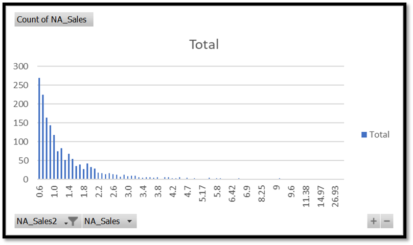
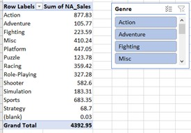
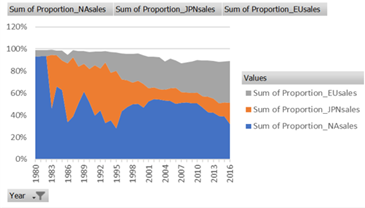
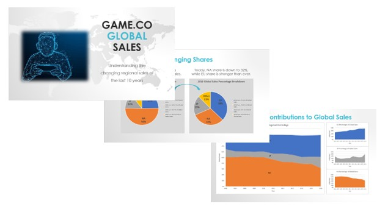

  <a href="https://tiltonneena.github.io/portfolio/">Back to Portfolio Homepage</a>

# Gamesco Trend Analysis of Video Games Sales
### By Neena Tilton

  

### Background
The executives at a video game company would like to use data related to game sales to inform the development of new games. Specifically, they are seeking to gain insight into the popularity of different game genres and regional distinctions in sales. The objective for this project is to perform an analysis on time-series and sales data to inform future budgeting for the development of new games. 

### Tools & Context
- **Microsoft Excel:** the bulk of the analysis was performed on this spreadsheet software, including filtering/cleaning data, creating pivot tables, data visualizations, creating new variables, and descriptive analysis. 

- **Microsoft PowerPoint:**  final presentation was drafted in this slide show software. 

### Data Source
Gamesco is a fictional company, but the global game sales [data set](https://github.com/tiltonneena/Gamesco-Project/blob/main/vgsales_clean.xlsx) used for this project is real and available on [VGChartz.com](https://www.vgchartz.com/gamedb/).

### Methodology
1. Analysis began with formulating detailed questions to inform the investigation. Then, to gain understanding of the data set, the source of the data was examined, each column was categorized as either quantitative or qualitative, and any biases implicit in the data were assessed. 

2. Once a complete picture of the data was pieced together, the cleaning process of finding and treating incomplete, unclear, extreme, or duplicate data took place.

    

      
    

    

      <em>Histograms were used to find extreme values that could potentially skew the analysis.</em>
    

    
3. Then, exploratory data analysis was performed to see how the data was distributed and to check for outliers. This was then followed by descriptive analysis to gain insight. 

    

      
    

    

      <em>PivotTables were used to group and summarize data, while filtering was done using slicers.</em>
    

    

      
    

    

      <em>Visualizations of the data were made to guide interpretation for descriptive analysis.</em>
    

    
4.  A narrative was developed about data insights to present to stakeholders. The final report was prepared and consolidated into a PowerPoint presentation.

### Key Findings
- The 3 regions with the strongest proportional sales were Japan, Europe, and North America.
- Europe's sales percentage has steadily increased since 2006. North America’s sales percentage has decreased since 2010. Japan’s sales percentage has been relatively consistent with a slight increase since 2012.
- The most popular game genres were action, sports, and shooter games. 

### Deliverable

#### [Final Stakeholder Presentation](https://drive.google.com/file/d/1o_6Km6w59hyS-gmy7FzcsOWjvWDH4FlL/view?usp=sharing)

  

  <a href="https://tiltonneena.github.io/portfolio/">Back to Portfolio Homepage</a>

